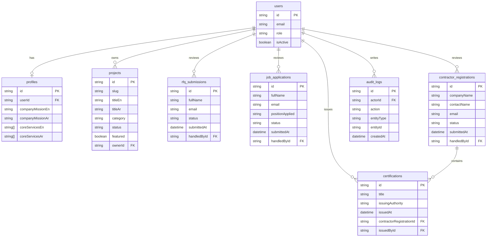
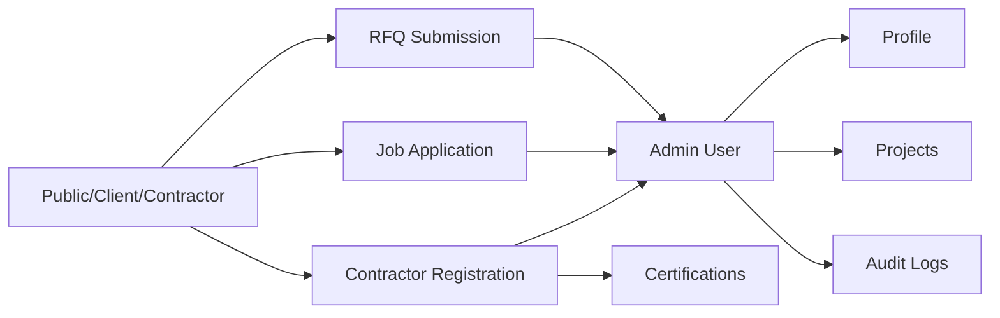
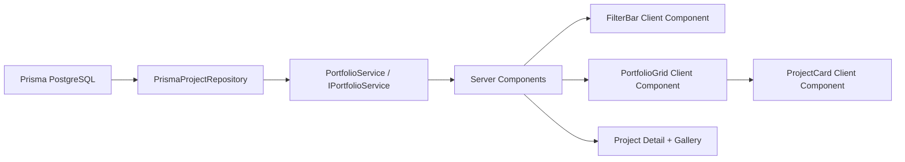

# Architecture

## Mission Fit

BP Holding's platform supports premium construction and engineering operations with Arabic-first UX, secure workflows, and scalable service modules.

## High-Level Layers

1. Presentation Layer

- Next.js App Router pages, layouts, and UI components.
- Locale-aware rendering with RTL/LTR support and translation-driven UI.

1. Application Layer

- Server actions and feature services (RFQ, careers, portfolio, admin).
- Validation boundaries with Zod.

1. Domain Layer

- Business entities and use-case interfaces.
- Role-based policies and workflow rules.

1. Infrastructure Layer

- Prisma repositories against PostgreSQL.
- Auth.js, ImageKit, logging, and rate-limiting adapters.

## SOLID Enforcement

- Single Responsibility: each component/hook/service has one purpose.
- Open/Closed: features extend via composition and interfaces.
- Liskov Substitution: repository contracts support implementation swaps.
- Interface Segregation: small, focused contracts per feature aggregate.
- Dependency Inversion: domain/application layers depend on repository interfaces, not Prisma directly.

## Directory Baseline

```text
src/
  app/
  components/
  i18n/
  lib/
    config/
    contexts/
    hooks/
    repositories/
    utils/
prisma/
tests/
docs/
```

## Data Model



## Relationship Flow



## Media Handling Strategy

- Delivery: project media is rendered through ImageKit Next components with responsive transformation chains (`w`, `q`, format) and URL-based optimization.
- Performance defaults: portfolio cards request 800px/85 quality variants for masonry cards, while detail galleries request larger responsive variants.
- Loading strategy: above-the-fold images are prioritized for preload; below-the-fold cards and gallery thumbnails use lazy loading.
- Utility layer: `src/lib/imagekit.ts` centralizes upload signing/upload execution and responsive URL generation via environment-based endpoints.

## Caching Strategy

- Portfolio list and detail routes use ISR (`revalidate = 3600`) to keep seeded project data fast and fresh on an hourly window.
- Server-rendered filtering and pagination are resolved in the service/repository pipeline, then cached at the route level for repeated traffic patterns.
- Image transformations are delegated to ImageKit CDN URLs so cacheable transformed assets are served from edge locations.

## Portfolio Data Flow



- Dependency inversion: server components call the portfolio service interface, while repository implementations remain swappable.
- Single responsibility: filtering logic lives in service/repository, grid virtualization in `PortfolioGrid`, project presentation in `ProjectCard`, and filter interaction in `FilterBar`.
